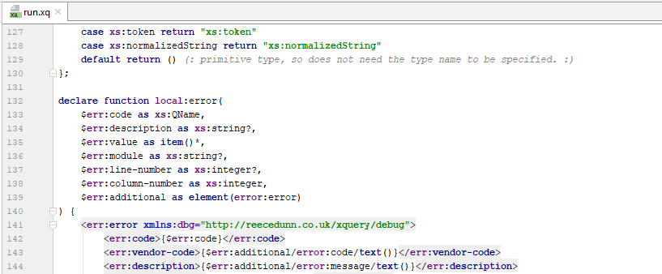

# IntelliJ XQuery Plugin

- [Features](#features)
  - [Language Support](#language-support)
  - [Invalid Syntax Recovery](#invalid-syntax-recovery)
  - [Warnings and Errors](#warnings-and-errors)
  - [IntelliJ Integration](#intellij-integration)
- [License Information](#license-information)

----------

This project provides XQuery support for the IntelliJ IDE.

_Supported IntelliJ Platforms:_ IntelliJ IDEA Community, IntelliJ IDEA Ultimate,
PhpStorm, WebStorm, PyCharm, RubyMine, AppCode, CLion, Rider, Android Studio

_Supported IntelliJ Versions:_ 2018.1 - 2018.3

_Supported XQuery Implementations:_ BaseX, eXist-db, MarkLogic, Saxonica Saxon,
W3C Specifications

## Features

### Language Support

A robust, standard conforming XQuery syntax highlighter and parser with file encoding
detection and error recovery. It supports the following W3C specifications:

*  XQuery 1.0, 3.0 and 3.1 core language;
*  XQuery and XPath Full Text 1.0 and 3.0 for XQuery;
*  XQuery Update Facility 1.0 and 3.0;
*  XQuery Scripting Extension 1.0.

It supports the following XQuery syntax extensions:

*  [BaseX](docs/XQuery%20IntelliJ%20Plugin.md#c1-basex-vendor-extensions) 7.8 and 8.5;
*  [MarkLogic](docs/XQuery%20IntelliJ%20Plugin.md#c2-marklogic-vendor-extensions) 6.0, 7.0, and 8.0;
*  [Saxon](docs/XQuery%20IntelliJ%20Plugin.md#c3-saxon-vendor-extensions) 9.4, and 9.8.

It has support for xqDoc documentation comments.

The plugin provides control over how XQuery dialects are interpreted.

### Invalid Syntax Recovery

When there is a syntax error in XQuery, this plugin will report that error. In
addition to this, it will attempt to recover and resume parsing. If there are
any errors, the parser will parse the next item as a new XQuery statement, and
if the file is a library module it will keep additional statements in the library
prolog so declared functions and variables remain visible outside the module.

If there is a missing keyword or symbol that is in an unambiguous place to
recover (such as a missing `then` keyword from an `if` statement), the parser
will report that missing keyword or symbol and then continue as if it was
present. This is not always possible, as given `if (true()) then else` the
`else` keyword is actually an XPath expression to select an `NCName`, not part
of the if statement.

If a CDATA section is used outside of an XML block, the parser will report it
and continue as if the CDATA section was a `text` node.

If `=` is used instead of `:=`, the parser will report this error and treat it
as if `:=` was used.

If a `QName` contains whitespace between the prefix, `:`, and local name the
plugin will report the error and continue as if the whitespace was not present.
If a `QName` is missing a prefix or local name the parser will report this error
and process the `QName` as if the prefix or local name were present, such as in
`<a:></a:>`.

If a `Wildcard` contains both a wildcard prefix and local name (`*:*`), the
parser will report this error and treat both wildcards as part of the same
wildcard node test.

If an `element`, `attribute`, `processing-instructor`, or `namespace` constructor
uses a string literal as the name (for example, `element "test" {}`), the error
is reported and the name is treated as if it was a braced expression.

If a parenthesized item type contains either an empty sequence or an occurrence
indicator, an error is reported and the resulting sequence type is treated as
the type associated with the parenthesized item type. For example,
`let $x as (xs:int+) := 2 return $x`.

### Warnings and Errors

Helpful error messages for invalid XQuery constructs.

Warnings for XQuery constructs that are valid in a different version or extension
to the one configured in the project.

### IntelliJ Integration

Resolve URI string literals to the files they reference.

Resolve namespaces, functions and variables to their corresponding declarations.

Code folding is supported for the following elements:

*  Comment;
*  DirElemConstructor;
*  EnclosedExpr (including function bodies).

Other supported IntelliJ features:

1.  Find usages.
2.  Paired brace matching.
3.  Commenting code support.

## Documents

[XQuery IntelliJ Plugin](docs/XQuery%20IntelliJ%20Plugin.md) &mdash;
The specification document for vendor and plugin extensions for XPath
and XQuery supported by the XQuery IntelliJ Plugin.

[XQuery IntelliJ Plugin Data Model](docs/XQuery%20IntelliJ%20Plugin%20Data%20Model.md)
&mdash; The specification document for XPath and XQuery Data Model
extensions used by the XQuery IntelliJ Plugin.

## License Information

Copyright (C) 2016-2018 Reece H. Dunn

The IntelliJ XQuery Plugin is licensed under the [Apache 2.0](LICENSE)
license.
